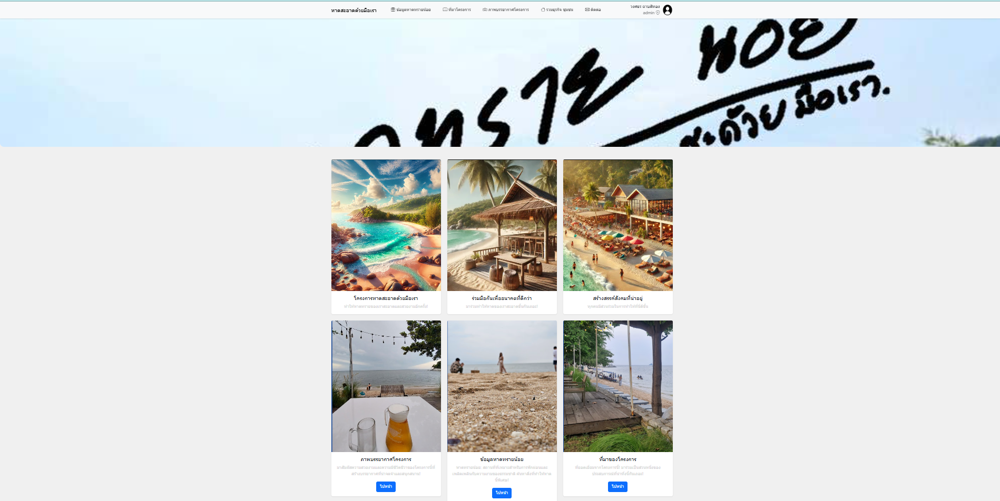
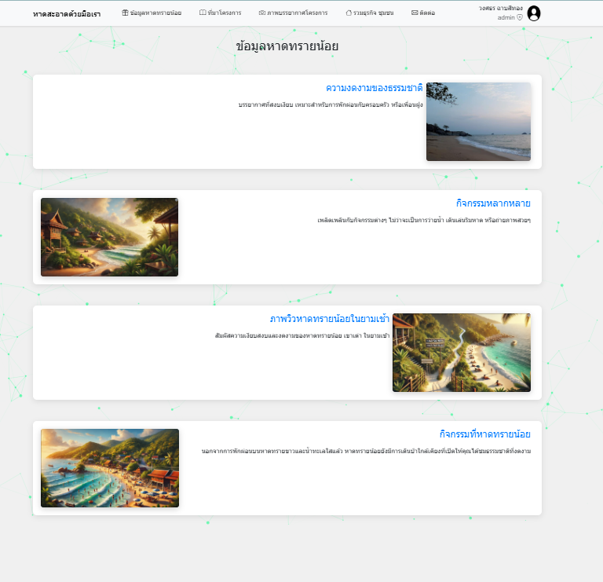
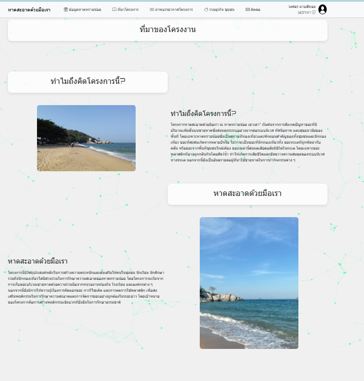
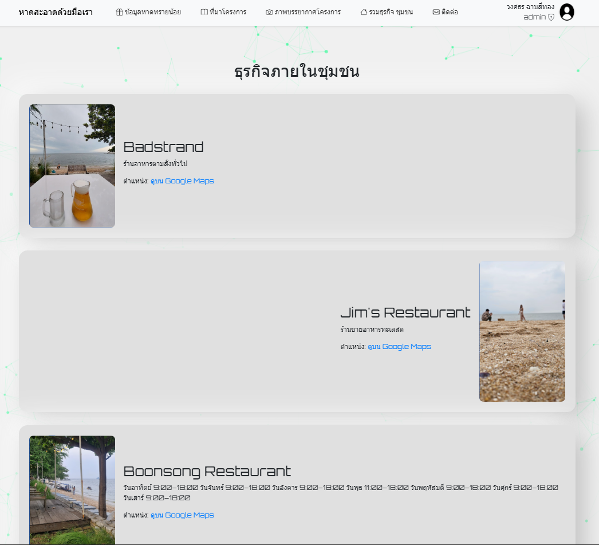
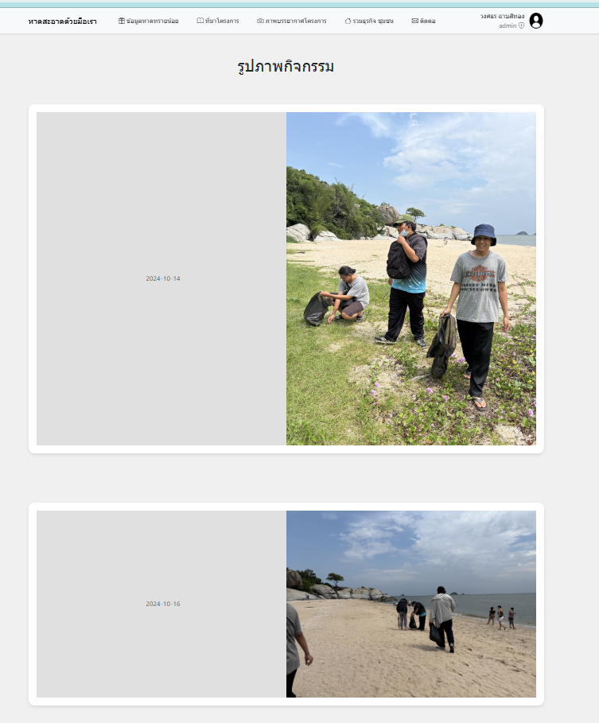
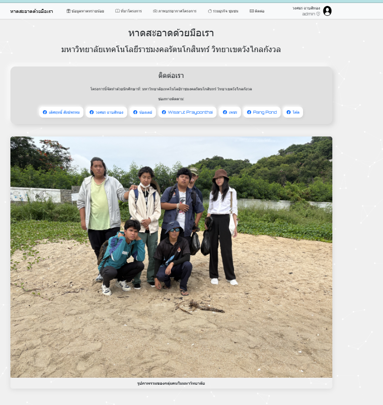
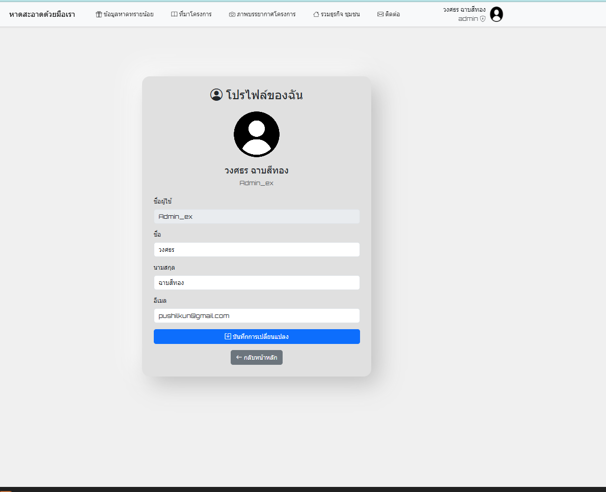
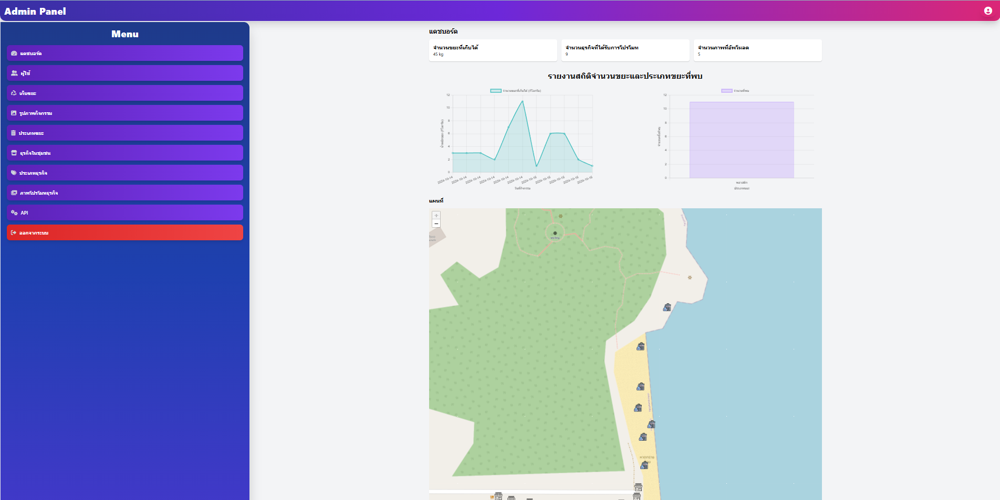

# หาดสะอาดด้วยมือเรา (Beach Cleanup Project)

โปรเจคเว็บไซต์สำหรับจัดการโครงการเก็บขยะชายหาด ณ หาดทรายน้อย จังหวัดประจวบคีรีขันธ์

## รายละเอียดโปรเจค

เว็บไซต์นี้พัฒนาขึ้นเพื่อสนับสนุนโครงการอนุรักษ์สิ่งแวดล้อมชายหาด โดยมีฟีเจอร์หลักดังนี้:

- **ระบบสมาชิก**: ลงทะเบียนและเข้าสู่ระบบสำหรับผู้เข้าร่วมกิจกรรม
- **ข้อมูลหาดทรายน้อย**: แนะนำสถานที่และกิจกรรม
- **ธุรกิจชุมชน**: แสดงธุรกิจท้องถิ่นพร้อมแผนที่
- **ภาพบรรยากาศ**: แกลลอรี่ภาพกิจกรรม
- **ระบบ Admin**: จัดการข้อมูลผู้ใช้ กิจกรรม และธุรกิจ

## เทคโนโลยีที่ใช้

- **Backend**: PHP (MySQLi / PDO)
- **Frontend**: HTML5, CSS3, JavaScript
- **Database**: MySQL/MariaDB
- **CSS Framework**: Bootstrap 5, Tailwind CSS
- **JavaScript Libraries**: 
  - AOS (Animate On Scroll)
  - Particles.js
  - Leaflet Maps
  - Alpine.js
- **Icons**: Bootstrap Icons, Font Awesome

## ภาพประกอบ

### หน้าหลัก


### ข้อมูลหาดทรายน้อย


### ที่มาโครงการ


### ธุรกิจชุมชน


### ภาพบรรยากาศโครงการ


### หน้าติดต่อ


### หน้าโปรไฟล์


### ระบบ Admin


## การติดตั้ง

### ความต้องการของระบบ

- XAMPP / WAMP / LAMP Server
- PHP 8.0 ขึ้นไป
- MySQL 5.7 ขึ้นไป หรือ MariaDB 10.4 ขึ้นไป

### ขั้นตอนการติดตั้ง

1. Clone repository ไปยัง `htdocs` folder:
```bash
cd C:\xampp\htdocs
git clone https://github.com/GitBababoo/Beach_2024-5-11.git
```

2. สร้าง Database และ import SQL:
```sql
CREATE DATABASE essduh_bns_member CHARACTER SET utf8mb4 COLLATE utf8mb4_general_ci;
USE essduh_bns_member;
SOURCE essduh_bns_member.sql;
```

3. ตั้งค่า Database Connection:
   - แก้ไขไฟล์ `db.php`, `DB_OC.php`, `Admin/db.php` ตามการตั้งค่า MySQL ของคุณ
   - ค่าเริ่มต้น: host=`localhost`, user=`root`, password=``, database=`essduh_bns_member`

4. สร้าง uploads folder และตั้ง permissions:
```bash
mkdir uploads
chmod 777 uploads
```

5. เข้าใช้งานผ่านเบราว์เซอร์:
```
http://localhost/Beach_2024-5-11/
```

## บัญชีทดสอบ

### Admin Account
- Username: `Admin_ex`
- Password: `newpassword123`

### User Account
- สมัครสมาชิกใหม่ได้ที่หน้า Register

## โครงสร้างโปรเจค

```
Beach_2024-5-11/
├── index.php              # หน้าหลัก
├── login.php              # หน้าเข้าสู่ระบบ
├── register.php           # หน้าลงทะเบียน
├── profile.php            # หน้าโปรไฟล์
├── ข้อมูลหาดทรายน้อย.php  # ข้อมูลสถานที่
├── ที่มาโครงการ.php      # ที่มาโครงการ
├── ธุรกิจชุมชน.php        # ธุรกิจท้องถิ่น
├── ภาพบรรยากาศโครงการ.php # แกลลอรี่ภาพ
├── contact.php            # หน้าติดต่อ
├── db.php                 # Database connection (main)
├── DB_OC.php              # Database connection (alternative)
├── Navigation Bar.php     # แถบนำทาง
├── hero.php               # ส่วน Hero banner
├── cards.php              # การ์ดแสดงข้อมูล
├── Footer.php             # ส่วนท้ายเว็บ
├── uploads/               # โฟลเดอร์เก็บรูปภาพ
├── Admin/                 # ระบบจัดการ Admin
│   ├── admin_Dashboard.php
│   ├── Login_admin.php
│   ├── users/
│   ├── cleanup_activities/
│   ├── businesses/
│   ├── API/
│   └── ...
└── essduh_bns_member.sql  # Database schema
```

## การแก้ไขปัญหาที่พบบ่อย

### 1. ปัญหาการเชื่อมต่อ Database
ตรวจสอบการตั้งค่าใน `db.php`:
```php
$host = 'localhost';
$user = 'root';
$pass = '';  // รหัสผ่าน MySQL
$dbname = 'essduh_bns_member';
```

### 2. ปัญหาอัปโหลดรูปภาพ
ตรวจสอบ permissions ของโฟลเดอร์ `uploads`:
```bash
chmod 777 uploads
```

### 3. ปัญหา session
ตรวจสอบว่า `session_start()` ถูกเรียกก่อน output ใดๆ

## ผู้พัฒนา

**นายวงศธร ฉาบสีทอง (Wongsathorn Chasetong)**

โปรเจคนี้เป็นส่วนหนึ่งของการเรียนรู้การพัฒนาเว็บแอปพลิเคชัน PHP

## License

โปรเจคนี้เป็น Open Source สำหรับการศึกษาและพัฒนาต่อยอด

---

*สร้างขึ้นด้วย ❤️ เพื่อสิ่งแวดล้อมที่ดีขึ้น*
